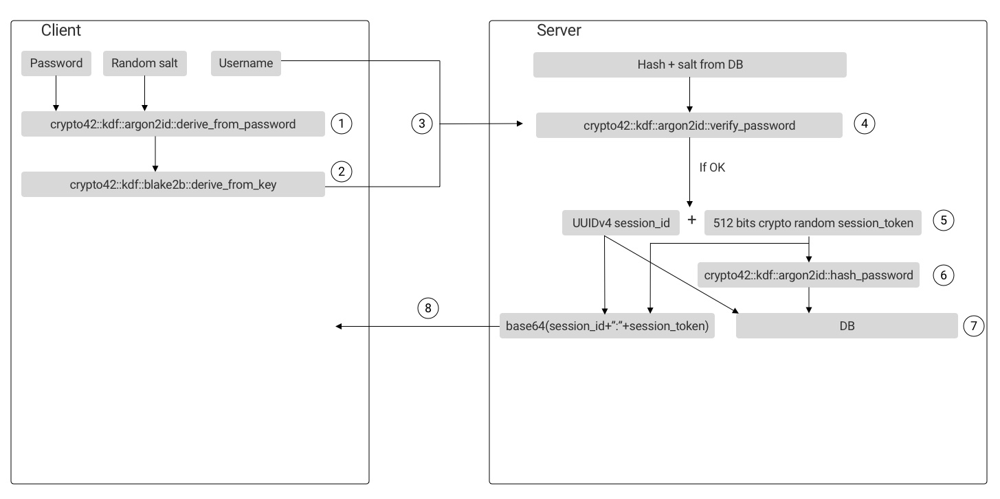

# Authentication

## Goals

* The server **NEVER** see the plaintext password
* 512 bits tokens
* CPU and mamoery hard hashing function

## Registration

1. A 512 bits key `pw_key` is derived from `password` using the `argon2id` KDF and a random `client_salt`
2. A 256 bits key `auth_key` is derived from `pwd_key` using `blake2b` from `crypto42::kdf`
3. `username` is sent with `auth_key` to server
4. Server hash `auth_key` to `auth_key_hash` using `crypto42::kdf::argon2id::hash_password`
5. Server generate a random UUIDv4 `session_id` and a 512 bits `session_token`
6. `session_token` is hashed using `crypto42::kdf::argon2id::hash_password` to product `session_token_hash`
7. Both `session_id` and `session_token_hash` are stored in the Database
8. `base64(session_id+":"+session_token)` is sent back to client to be used as `auth_token`
9. Client save both `client_salt` and `auth_token` fot future use

## Signin in

1. A 256 bits key `pw_key` is derived from `password` using the `argon2id` KDF and the saved `client_salt`
2. A 512 bits key `auth_key` is derived from `pwd_key` using `blake2b` from `crypto42::kdf`
3. `username` is sent with `auth_key` to server
4. Server verify that `auth_key` match stored `auth_key_hash` using `crypto42::kdf::argon2id::verify_password`
5. If ok, server generate a random UUIDv4 `session_id` and a 512 bits `session_token`
6. `session_token` is hashed using `crypto42::kdf::argon2id::hash_password` to product `session_token_hash`
7. Both `session_id` and `session_token_hash` are stored in the Database
8. `base64(session_id+":"+session_token)` is sent back to client to be used as `auth_token`

## Signin out

1. client send `com.bloom42.auth.sign_out` message to server
2. sever DELETE the session associated with the received message

## Revoking a session

1. client send `com.bloom42.auth.revoke_session` message to the server which contain the `session_id` field.
2. sever DELETE the session associated with `session_id`

## Changing the Password

## Resetting password

**Because of the encryption used to protect the data, resetting the password in Bloom is different
from other, less secure services. The password is used to decrypt the data, and we do not have access to it.
Therefore, a user resetting his password will lose all his data**

## Resources

* https://github.com/mozilla/fxa-auth-server/wiki/onepw-protocol#changing-the-password
* https://blog.mozilla.org/warner/2014/05/23/the-new-sync-protocol/
* https://hacks.mozilla.org/2018/11/firefox-sync-privacy/
* https://docs.google.com/document/d/1IvQJFEBFz0PnL4uVlIvt8fBS_IPwSK-avK0BRIHucxQ/edit (*Scoped Encryption Keys for Firefox Accounts*)
* https://blogs.dropbox.com/tech/2016/09/how-dropbox-securely-stores-your-passwords/
* https://medium.com/@harwoeck/password-and-credential-management-in-2018-56f43669d588
* https://medium.com/@mpreziuso/password-hashing-pbkdf2-scrypt-bcrypt-and-argon2-e25aaf41598e
* https://blog.filippo.io/the-scrypt-parameters/
* https://news.ycombinator.com/item?id=18446278 *(Private by Design: How We Built Firefox Sync)*

## See also

### SRP

SRP, and SPAKE2 were discarded because too complexe (choice of primes...) and so too easy to screw up.

* https://docs.rs/srp/0.4.0/srp
* http://srp.stanford.edu/ndss.html
* https://protonmail.com/blog/encrypted_email_authentication/
* https://en.wikipedia.org/wiki/Secure_Remote_Password_protocol
* https://www.computest.nl/nl/knowledge-platform/blog/exploiting-two-buggy-srp-implementations/
* https://blog.cryptographyengineering.com/should-you-use-srp/
* https://blog.1password.com/developers-how-we-use-srp-and-you-can-too/
* https://medium.com/@intermediation/secure-remote-password-protocol-31ba8c2ab0b
* [ProtonMail whitepaper](/assets/resources/protonmail-whitepaper.pdf)
* https://docs.rs/spake2
* https://www.cossacklabs.com/zero-knowledge-protocols-without-magic.html
